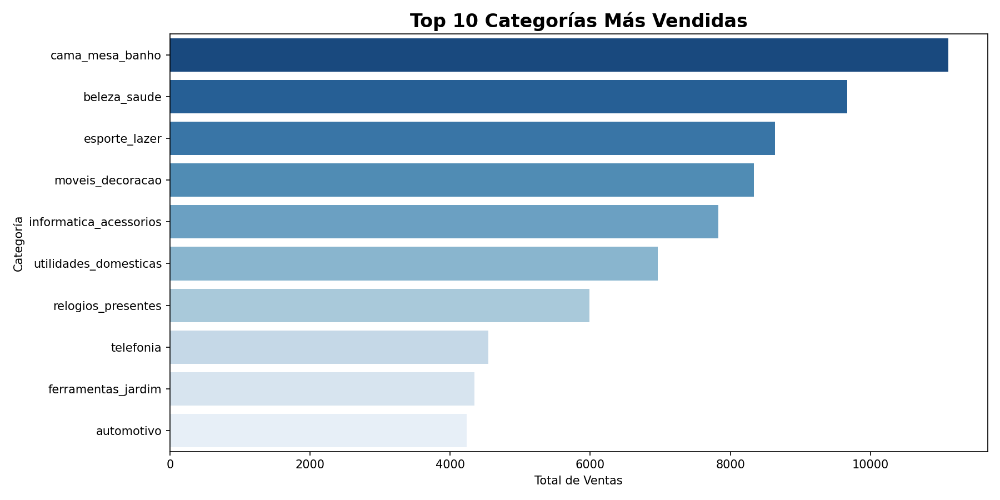
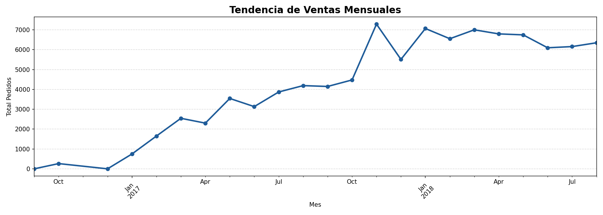
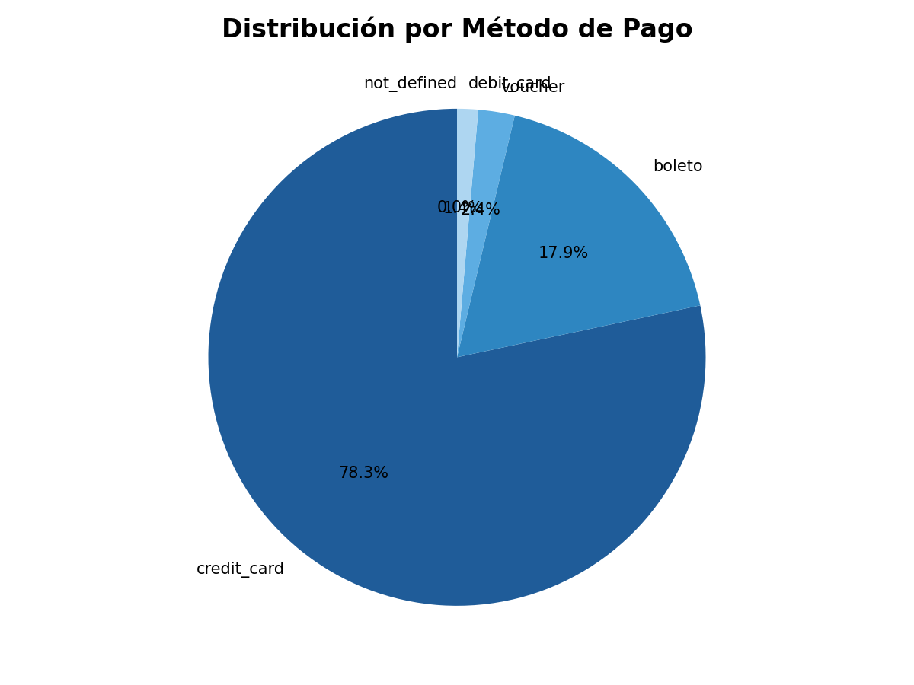

# 📊 Análisis de Ventas E-Commerce con SQL y Python

## 📌 Descripción
Análisis exploratorio de datos de ventas retail usando SQL Server y Python.
Dataset: Olist E-Commerce (99,441 pedidos | 112,650 items).

## 🎯 Preguntas de Negocio Respondidas
- ¿Cuáles son las 10 categorías más vendidas?
- ¿Cómo evolucionaron las ventas mes a mes?
- ¿Qué método de pago prefieren los clientes?

## 🛠️ Herramientas Utilizadas
- SQL Server — consultas, joins, CTEs, agregaciones
- Python — Pandas, Matplotlib, Seaborn
- Google Colab — entorno de análisis

## 📈 Resultados Principales
- **cama_mesa_banho** es la categoría más vendida con 11,115 unidades
- Las ventas crecieron **+7,000% entre Oct 2016 y Oct 2017**
- **Tarjeta de crédito** representa el método de pago dominante

## 📊 Visualizaciones

### Top 10 Categorías Más Vendidas


### Tendencia de Ventas Mensuales


### Distribución por Método de Pago


## 📂 Estructura del Proyecto
```
├── notebooks/    # Análisis completo en Python
├── imagenes/     # Gráficos generados
└── README.md
```

## 👤 Autor
**Rodrigo Antonio Aniceto Nuñez**  
Analista de Datos | Lima, Perú  
[LinkedIn](https://linkedin.com/in/rodrigo-aniceto-nuñez)